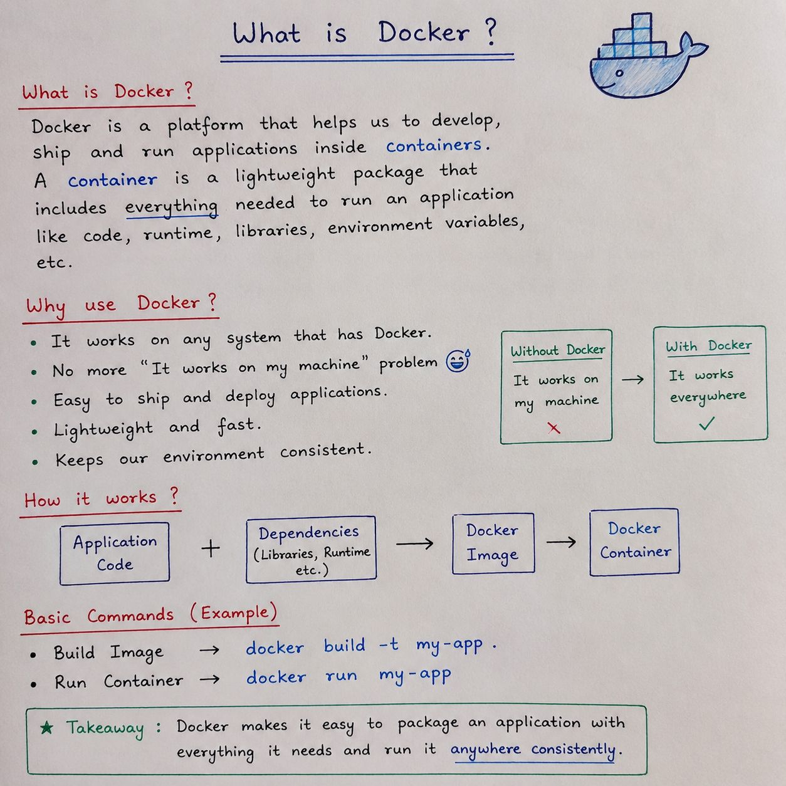

# 🐳 What is Docker?

Docker is a platform used to **package and run applications in isolated environments called containers**.

It allows us to package an application together with the dependencies and configuration required to run it.

This helps create a more **consistent environment** across development, testing, and deployment.

---

## 📌 What is Docker?



In simple terms:

> **Docker packages an application and everything it needs to run into a containerized environment.**

For example, a Java/Spring Boot application may require:

- Java
- Application code
- Libraries
- Dependencies
- Configuration

Docker helps package these requirements so the application can run in a consistent environment.

---

## 🤔 Why Do We Use Docker?

A common problem in software development is:

> **"It works on my machine."**

An application may work on one computer but fail on another because of differences in:

- Operating system
- Runtime versions
- Libraries
- Dependencies
- Configuration

Docker helps reduce these environment-related problems by providing a consistent environment for the application.

---

## 📦 What Does Docker Package?

Consider a Java/Spring Boot application.

It may need:

```text
Application Code
       +
Java Runtime
       +
Libraries & Dependencies
       +
Configuration