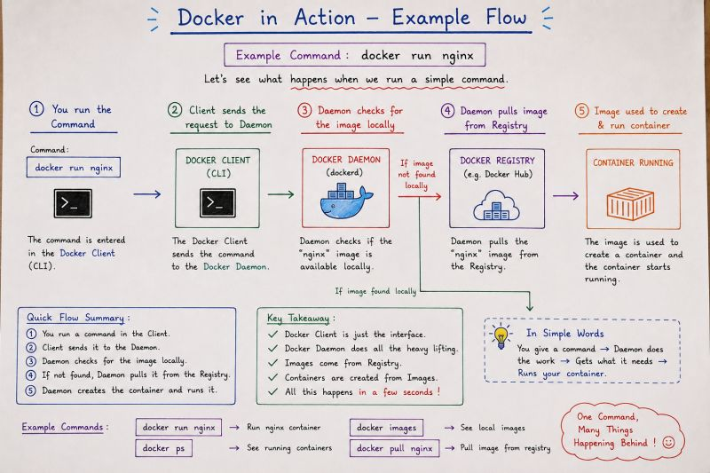

# 🏗️ Docker Architecture

Docker uses a **client-server architecture**.

Different components work together to build, run, manage, and distribute containers.

The main components to understand are:

- Docker Client
- Docker Daemon
- Docker Engine
- Docker Registry
- Docker Images
- Docker Containers

---

## 📌 Docker Architecture



---

# 🧩 Main Components of Docker Architecture

## 1️⃣ Docker Client

The **Docker Client** is the interface through which we interact with Docker.

When we type a Docker command in the terminal, the Docker Client sends the request to the Docker Daemon.

Some common Docker commands are:

```bash
docker build
docker run
docker ps
docker images
docker pull
docker push