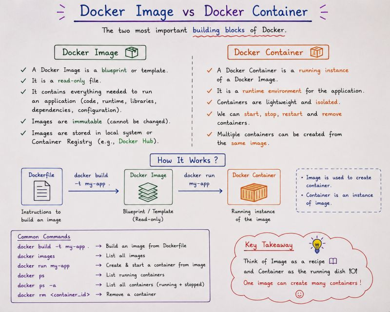

# 📦 Docker Image vs Docker Container

A Docker Image and a Docker Container are related, but they are not the same thing.

A simple way to remember the difference is:

> **Image = Blueprint**
>
> **Container = Running instance of the Image**

---

## 📌 Image vs Container



---

# 🧱 What is a Docker Image?

A **Docker Image** is a read-only template used to create Docker Containers.

It contains everything required to run an application, such as:

- Application code
- Dependencies
- Libraries
- Configuration
- Required runtime

For example, the `nginx` image contains everything required to run Nginx.

We can see the images available on our system using:

```bash
docker images