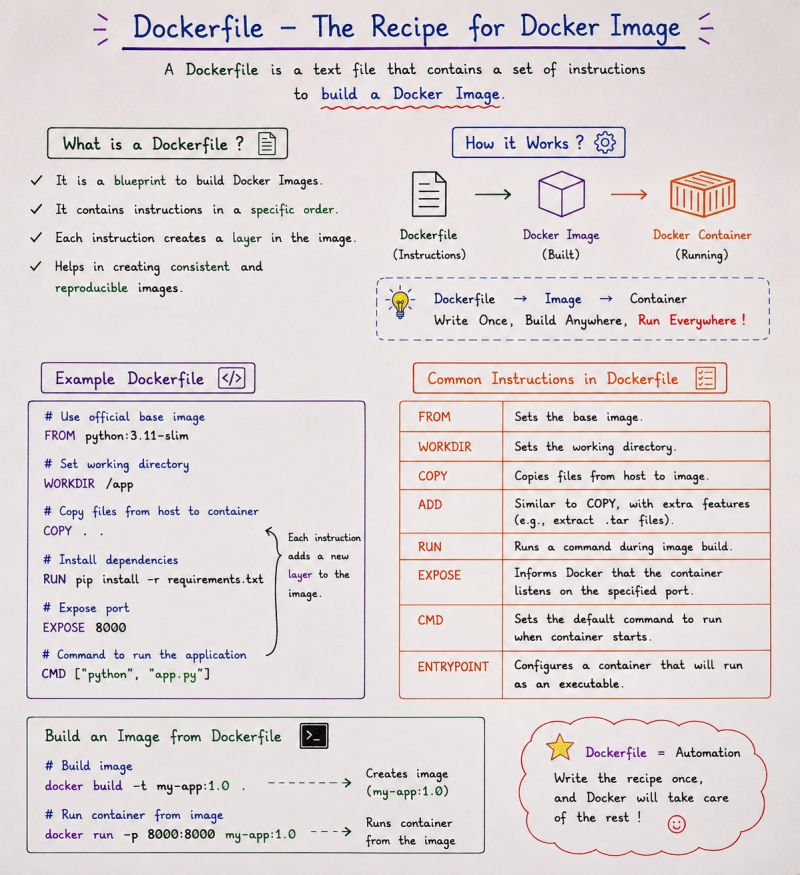

# 📄 Dockerfile

A **Dockerfile** is a text file that contains instructions used to build a **Docker Image**.

Instead of manually setting up an application environment every time, we can define the required steps inside a Dockerfile.

Docker then reads these instructions and creates an image.

---

## 📌 Dockerfile



---

# 🤔 Why Do We Need a Dockerfile?

Suppose we want to create an environment for an application.

We may need to:

- Choose a base operating system or image
- Install required software
- Copy application files
- Set a working directory
- Configure ports
- Define the command to run the application

Doing this manually every time can be repetitive.

A Dockerfile allows us to define these steps in a file.

```text
Dockerfile
     ↓
Docker Build
     ↓
Docker Image
     ↓
Docker Container