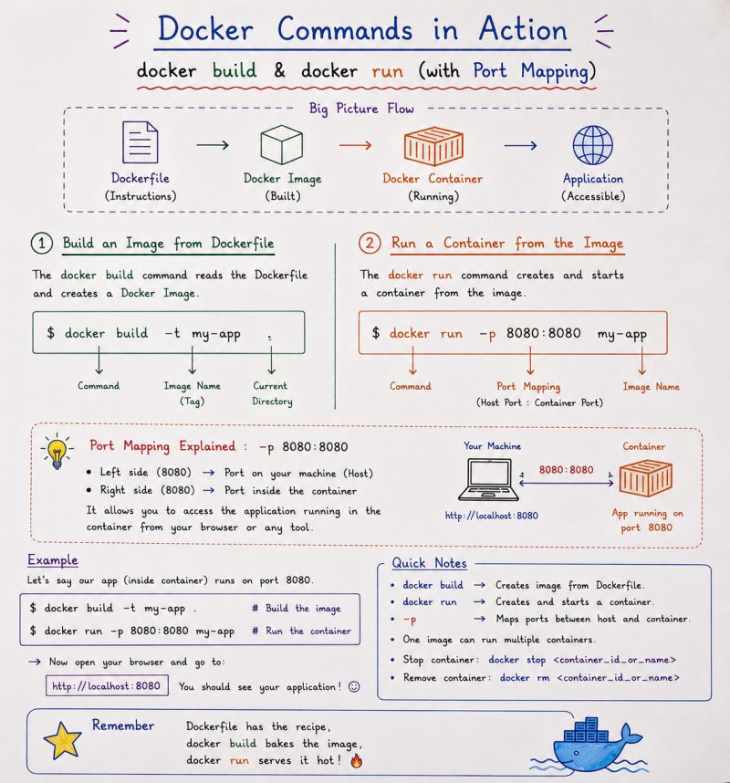

# 🔨 Docker Build & Run

After understanding Dockerfiles, the next step is to actually **build a Docker Image and run a Container from it**.

The basic process is:

```text
Dockerfile
     ↓
docker build
     ↓
Docker Image
     ↓
docker run
     ↓
Docker Container
```
---

## 📌 Docker Build & Run



The image shows the basic relationship between:

- Dockerfile
- Docker Image
- Docker Container

---