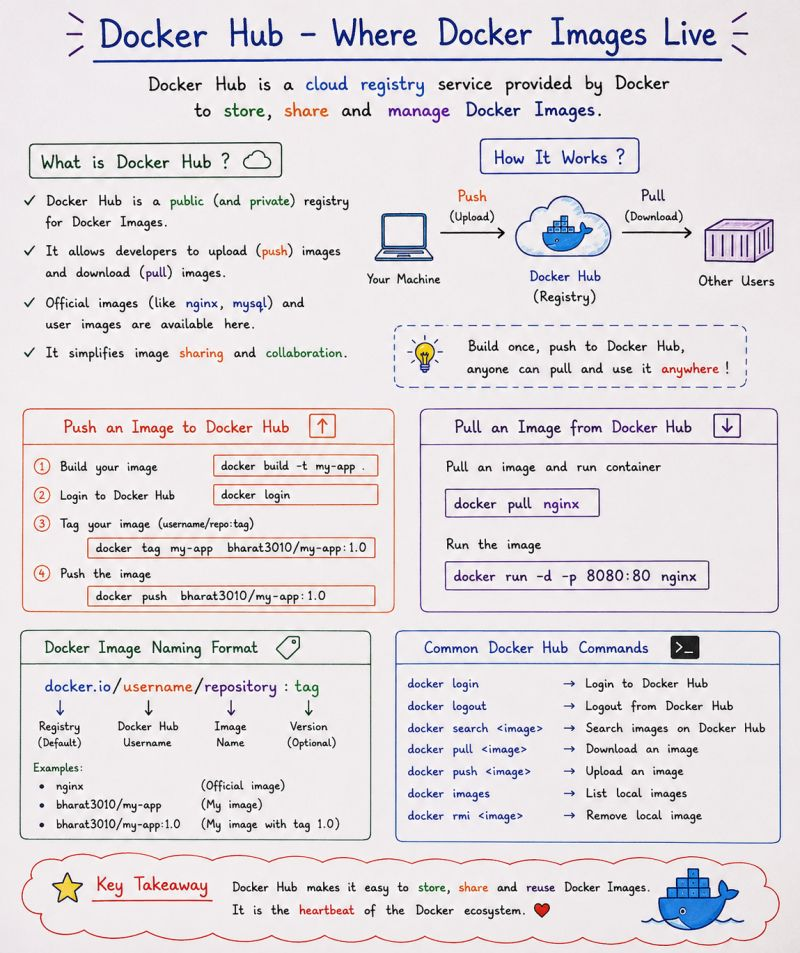

# 🐳 Docker Hub

After building a Docker Image and running a Container, the next step is understanding how Docker Images can be **stored and shared**.

For this, we can use **Docker Hub**.

The basic flow is:

```text
Dockerfile
     ↓
docker build
     ↓
Docker Image
     ↓
docker tag
     ↓
Docker Hub
     ↓
docker pull
     ↓
Docker Image
     ↓
Docker Container
```

---

## 📌 Docker Hub



**Docker Hub** is a public registry where Docker Images can be stored and shared.

It allows us to:

- Store Docker Images
- Share Images
- Download Images
- Use Images on different machines
- Pull existing Images from repositories

---

# 1️⃣ Check Docker

Make sure Docker is running:

```bash
docker --version
```

Check:

```bash
docker ps
```

---

# 2️⃣ Login to Docker Hub

Login using:

```bash
docker login
```

Docker will ask for your Docker Hub username and password/token.

After successful login, you should see:

```text
Login Succeeded
```

---

# 3️⃣ Check Our Docker Image

List the images available locally:

```bash
docker images
```

For example:

```text
REPOSITORY      TAG       IMAGE ID
my-docker-app   latest    xxxxxxxx
```

Our image is:

```text
my-docker-app:latest
```

---

# 4️⃣ Understand Docker Hub Repository Names

Before pushing an image to Docker Hub, the image needs to be tagged using the Docker Hub username.

The format is:

```text
<dockerhub-username>/<repository-name>:<tag>
```

Example:

```text
bharat3010/my-docker-app:v1
```

Replace `bharat3010` with your actual Docker Hub username.

---

# 5️⃣ Tag the Docker Image

Tag the local image:

```bash
docker tag my-docker-app:latest <dockerhub-username>/my-docker-app:v1
```

Example:

```bash
docker tag my-docker-app:latest bharat3010/my-docker-app:v1
```

Check the images:

```bash
docker images
```

You should now see something similar to:

```text
REPOSITORY                    TAG
my-docker-app                latest
bharat3010/my-docker-app     v1
```

The tag connects our local image with the Docker Hub repository name.

---

# 6️⃣ Push the Image to Docker Hub

Push the image:

```bash
docker push <dockerhub-username>/my-docker-app:v1
```

Example:

```bash
docker push bharat3010/my-docker-app:v1
```

Docker uploads the image layers to Docker Hub.

The basic flow is:

```text
Local Docker Image
        ↓
docker push
        ↓
Docker Hub Repository
```

---

# 7️⃣ Check the Image on Docker Hub

Open your Docker Hub account and check the repository.

You should see:

```text
Repository:
my-docker-app

Tag:
v1
```

The image is now stored in Docker Hub.

---

# 8️⃣ Pull an Image from Docker Hub

Another machine can download the image using:

```bash
docker pull <dockerhub-username>/my-docker-app:v1
```

Example:

```bash
docker pull bharat3010/my-docker-app:v1
```

The basic flow is:

```text
Docker Hub
     ↓
docker pull
     ↓
Local Docker
     ↓
Docker Image
```

---

# 9️⃣ Check the Downloaded Image

Run:

```bash
docker images
```

You should see:

```text
REPOSITORY                    TAG
bharat3010/my-docker-app     v1
```

---

# 🔟 Run the Pulled Image

We can create a container from the image:

```bash
docker run -d --name my-docker-container -p 8080:80 <dockerhub-username>/my-docker-app:v1
```

Example:

```bash
docker run -d --name my-docker-container -p 8080:80 bharat3010/my-docker-app:v1
```

Check the container:

```bash
docker ps
```

---

# 1️⃣1️⃣ Access the Application

If the image contains the Nginx application from the previous hands-on, open:

```text
http://<EC2-PUBLIC-IP>:8080
```

The request flow is:

```text
Browser
    ↓
EC2
    ↓
Docker Container
    ↓
Docker Image
    ↓
Nginx
    ↓
Application
```

---

# 🔄 Complete Docker Hub Workflow

The complete workflow is:

```text
Dockerfile
     ↓
docker build
     ↓
Docker Image
     ↓
docker tag
     ↓
docker push
     ↓
Docker Hub
     ↓
docker pull
     ↓
Docker Image
     ↓
docker run
     ↓
Docker Container
```

---

# 🧠 Important Commands

| Command | Purpose |
|---|---|
| `docker login` | Login to Docker Hub |
| `docker images` | List local images |
| `docker tag` | Create a new image tag |
| `docker push` | Upload an image to Docker Hub |
| `docker pull` | Download an image from Docker Hub |
| `docker run` | Create and start a container |

---

# 🎯 Key Takeaway

The important idea is:

```text
docker build
     ↓
Create Image
     ↓
docker tag
     ↓
Prepare Image Name
     ↓
docker push
     ↓
Store Image on Docker Hub
```

And on another machine:

```text
docker pull
     ↓
Download Image
     ↓
docker run
     ↓
Container
```

> **Docker Image = Package**

> **Docker Hub = Place to store and share Images**

> **docker push = Upload**

> **docker pull = Download**

---

# 📚 Concepts Covered

- Docker Hub
- Docker Registry
- Docker Hub Repository
- Docker Login
- Docker Image Tags
- `docker tag`
- `docker push`
- `docker pull`
- Running a pulled Image
- Sharing Docker Images